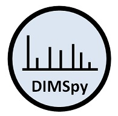

# DIMSpy

version: v1.1.0

## Short description

Python package for processing, filtering and analysing direct-infusion mass spectrometry-based metabolomics and lipidomics data

## Description

Container for Python package DIMSpy: processing, filtering and analysing direct-infusion mass spectrometry-based metabolomics and lipidomics data

## Key features

- DIMS data processing

## Functionalities

- Processing
- Filtering
- Analysing

## Instrument Data Types

- MS

## Tool Authors
 - Ralf J. M. Weber (r.j.weber@bham.ac.uk) - [University of Birmingham (UK)](http://www.birmingham.ac.uk/index.aspx)
 - Jiarui (Albert) Zhou (j.zhou.3@bham.ac.uk) - [University of Birmingham (UK)](http://www.birmingham.ac.uk/index.aspx)
 - Thomas N. Lawson (tnl495@bham.ac.uk) - [University of Birmingham (UK)](http://www.birmingham.ac.uk/index.aspx)
 - Martin R. Jones (m.r.jones.1@bham.ac.uk) - [University of Birmingham (UK)](http://www.birmingham.ac.uk/index.aspx)

## Container Contributors
- James Bradbury (j.bradbury@bham.ac.uk) - [University of Birmingham (UK)](http://www.birmingham.ac.uk/index.aspx)
- Ralf J. M. Weber (r.j.weber@bham.ac.uk) - [University of Birmingham (UK)](http://www.birmingham.ac.uk/index.aspx)

## Website

- https://github.com/computational-metabolomics/dimspy

## Git Repository

- https://github.com/computational-metabolomics/dimspy

## Installation 

DIMSpy is present on all PhenoMeNal Galaxy instances on deployed Cloud Research Environments, under the MS category in the tool bar to the left of the screen. No installation is needed hence on PhenoMeNal Cloud Research Environments.

For advanced Docker usage:

- Go to the directory where the dockerfile is.
- Create container from dockerfile:

```bash
docker build -t dimspy .
```

Alternatively, pull from repo:

```bash
docker pull container-registry.phenomenal-h2020.eu/phnmnl/dimspy
```

## Usage Instructions

On a PhenoMeNal Cloud Research Environment, go to MS tool category, and then click on DIMSpy.

Advanced usage through docker

```bash
docker run docker-registry.phenomenal-h2020.eu/phnmnl/dimspy dimspy -h
```

## Publications

- Southam, Andrew D and Weber, Ralf J M and Engel, Jasper and Jones, Martin R and Viant, Mark R (2017). A complete workflow for high-resolution spectral-stitching nanoelectrospray direct-infusion mass-spectrometry-based metabolomics and lipidomics. In Nature Protocols, 12 (2), pp. 255–273. doi:10.1038/nprot.2016.156

- Kirwan, Jennifer A and Weber, Ralf J M and Broadhurst, David I and Viant, Mark R (2014). Direct infusion mass spectrometry metabolomics dataset: a benchmark for data processing and quality control. In Scientific Data, 1. doi:10.1038/sdata.2014.12

- Southam, Andrew D. and Payne, Tristan G. and Cooper, Helen J. and Arvanitis, Theodoros N. and Viant, Mark R. (2007). Dynamic Range and Mass Accuracy of Wide-Scan Direct Infusion Nanoelectrospray Fourier Transform Ion Cyclotron Resonance Mass Spectrometry-Based Metabolomics Increased by the Spectral Stitching Method. In Analytical Chemistry, 79 (12), pp. 4595–4602. doi:10.1021/ac062446p

- Weber, Ralf J. M. and Southam, Andrew D. and Sommer, Ulf and Viant, Mark R. (2011). Characterization of Isotopic Abundance Measurements in High Resolution FT-ICR and Orbitrap Mass Spectra for Improved Confidence of Metabolite Identification. In Analytical Chemistry, 83 (10), pp. 3737–3743. doi:10.1021/ac2001803


